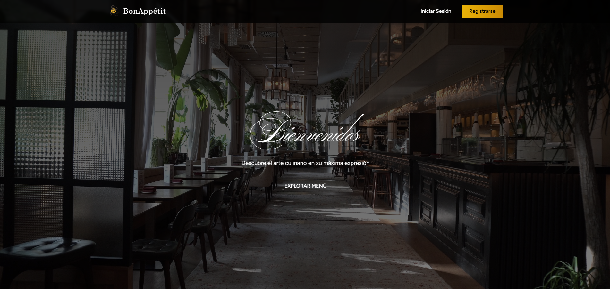

<div align="center">
  
  
  # 🍽️ BonAppétit Web
  
  ### Aplicación de Restaurante con Gestión Completa
  
  Aplicación web completa para gestión de restaurante con sistema de reservaciones, menú digital y búsqueda de recetas.
  
  ---
</div>

## 📋 Requisitos del Proyecto

### ✅ 1. Mecanismos de Seguridad

#### Autenticación y Autorización
- **Laravel Breeze**: Sistema completo de autenticación (login, registro, recuperación de contraseña)
- **Verificación de Email**: Protección de rutas con middleware `verified`
- **Sistema de Roles**: Usuarios normales y administradores
- **Middleware Personalizado**: `EnsureUserIsAdmin` para proteger rutas de administrador

#### Protección de Datos
- **Protección CSRF**: Tokens CSRF en todos los formularios
- **Validación de Datos**: Validación robusta en todos los endpoints
- **Sanitización**: Limpieza automática de datos de entrada
- **Rate Limiting**: 
  - 60 peticiones/minuto para endpoints públicos
  - 100 peticiones/minuto para usuarios autenticados
  - 200 peticiones/minuto para administradores

#### Headers de Seguridad
- X-Content-Type-Options: nosniff
- X-XSS-Protection
- Content-Security-Policy
- Referrer-Policy

#### Sesiones Seguras
- Almacenamiento en base de datos
- Cookies HTTP-only
- Encriptación de cookies
---

### ✅ 2. Web Services de Terceros

#### API de Spoonacular
Integración completa con la API de Spoonacular para búsqueda de recetas.

**Endpoints Implementados:**
- `GET /api/recetas/buscar` - Buscar recetas por término
- `GET /api/recetas/detalle/{id}` - Obtener detalle de receta
- `GET /api/recetas/aleatorias` - Recetas aleatorias
- `GET /api/recetas/categoria/{tipo}` - Recetas por categoría (breakfast, lunch, dinner, snack, dessert)

**Características:**
- Validación de parámetros
- Manejo de errores
- Timeouts configurados (10 segundos)
- Respuestas JSON estandarizadas

---

### ✅ 3. Web Services Propios

#### API de Favoritas (CRUD Completo)
- `GET /api/favoritas` - Listar favoritas del usuario
- `GET /api/favoritas/{id}` - Ver favorita específica
- `POST /api/favoritas` - Agregar receta a favoritas
- `PUT /api/favoritas/{id}` - Actualizar favorita
- `DELETE /api/favoritas/{id}` - Eliminar favorita
- `GET /api/favoritas/check/{recetaId}` - Verificar si es favorita

#### API de Valoraciones (CRUD Completo)
- `GET /api/valoraciones/{recetaId}/promedio` - Promedio de valoraciones
- `GET /api/valoraciones/{recetaId}/distribucion` - Distribución de estrellas
- `GET /api/valoraciones/{recetaId}/mi-valoracion` - Mi valoración
- `POST /api/valoraciones` - Crear/actualizar valoración (1-5 estrellas)
- `DELETE /api/valoraciones/{recetaId}` - Eliminar valoración

#### API de Reservaciones (CRUD Completo)
- `GET /api/reservaciones` - Listar mis reservaciones
- `POST /api/reservaciones` - Crear reservación
- `PUT /api/reservaciones/{id}` - Actualizar reservación
- `PUT /api/reservaciones/{id}/cancelar` - Cancelar reservación
- `DELETE /api/reservaciones/{id}` - Eliminar reservación

#### API de Gestión de Usuarios
- `GET /api/user/me` - Información del usuario
- `PUT /api/user/profile` - Actualizar perfil
- `PUT /api/user/password` - Cambiar contraseña
- `GET /api/user/stats` - Estadísticas del usuario
- `DELETE /api/user/account` - Eliminar cuenta

#### API de Menú del Restaurante (Público)
- `GET /api/menu` - Ver menú disponible
- `GET /api/menu/{id}` - Ver item específico

#### APIs de Administrador
**Gestión de Reservaciones:**
- `GET /api/admin/reservaciones` - Ver todas las reservaciones
- `PUT /api/admin/reservaciones/{id}/confirmar` - Confirmar reservación
- `PUT /api/admin/reservaciones/{id}/cancelar` - Cancelar reservación
- `GET /api/admin/reservaciones/estadisticas` - Estadísticas

**Gestión de Menú:**
- `GET /api/admin/menu` - Listar todos los items
- `POST /api/admin/menu` - Agregar item al menú
- `PUT /api/admin/menu/{id}` - Actualizar item
- `DELETE /api/admin/menu/{id}` - Eliminar item
- `PUT /api/admin/menu/{id}/toggle-disponibilidad` - Cambiar disponibilidad

**Total: 35 endpoints implementados**

---

## 🏗️ Arquitectura del Proyecto

### Tecnologías Utilizadas

**Backend:**
- Laravel 12
- PHP 8.2+
- MySQL
- Laravel Breeze (Autenticación)
- Laravel Sanctum (API)

**Frontend:**
- React 18
- Inertia.js
- Tailwind CSS
- Axios

**APIs Externas:**
- Spoonacular API

---

## 📦 Instalación

### Requisitos Previos
- PHP 8.2 o superior
- Composer
- Node.js 18+ y npm
- MySQL

### Pasos de Instalación

1. **Clonar el repositorio**
```bash
git clone <repository-url>
cd bonappetit_web
```

2. **Instalar dependencias de PHP**
composer install


3. **Instalar dependencias de Node**
```bash
npm install
```

4. **Configurar el archivo .env**
```bash
cp .env.example .env
```

Editar `.env` y configurar:
```env
DB_CONNECTION=mysql
DB_DATABASE=bonappetit_web
DB_USERNAME=root
DB_PASSWORD=

SPOONACULAR_KEY=tu_api_key_aqui
```

5. **Generar key de aplicación**
```bash
php artisan key:generate
```

6. **Crear base de datos**
```sql
CREATE DATABASE bonappetit_web;
```

7. **Ejecutar migraciones**
```bash
php artisan migrate
```

8. **Crear usuario administrador**
```bash
php artisan db:seed --class=AdminUserSeeder
```

9. **Compilar assets**
```bash
npm run build
```

---

## 🚀 Ejecución

### Modo Desarrollo

**Terminal 1 - Backend:**
```bash
php artisan serve
```

**Terminal 2 - Frontend:**
```bash
npm run dev
```

La aplicación estará disponible en: http://127.0.0.1:8000

---

## 👥 Usuarios de Prueba

### Administrador
```
Email: admin@bonappetit.com
Password: admin123
```

### Usuario Normal
Crear cuenta en: http://127.0.0.1:8000/register

---

## 🎯 Funcionalidades

### Para Usuarios Normales

#### 🔍 Búsqueda de Recetas
- Buscar recetas por término
- Explorar recetas por categorías
- Ver recetas aleatorias
- Ver detalle completo de recetas

#### ⭐ Favoritas
- Agregar recetas a favoritas
- Ver lista de favoritas
- Eliminar de favoritas
- Botón rápido en cada receta

#### 🌟 Valoraciones
- Valorar recetas (1-5 estrellas)
- Ver promedio de valoraciones
- Ver distribución de estrellas
- Actualizar valoración

#### 📅 Reservaciones
- Crear reservación
- Ver mis reservaciones
- Editar reservación
- Cancelar reservación
- Ver estado (Pendiente/Confirmada/Cancelada)

### Para Administradores

#### 📊 Panel de Administración
- Estadísticas en tiempo real
- Total de reservaciones
- Reservaciones pendientes
- Reservaciones confirmadas
- Reservaciones del día

#### 📅 Gestión de Reservaciones
- Ver TODAS las reservaciones de todos los usuarios
- Filtrar por estado (Pendiente/Confirmada/Cancelada)
- Confirmar reservaciones
- Cancelar reservaciones
- Ver información del cliente

#### 🍽️ Gestión de Menú
- Agregar platillos al menú
- Editar platillos (nombre, precio, descripción, etc.)
- Cambiar disponibilidad
- Eliminar platillos
- Categorías: Entrada, Plato Fuerte, Postre, Bebida

---

## 🗄️ Base de Datos

### Tablas Principales

- **users** - Usuarios del sistema (con campo `role`)
- **favoritas** - Recetas favoritas de usuarios
- **valoraciones** - Valoraciones de recetas (1-5 estrellas)
- **reservaciones** - Reservaciones de restaurante
- **menu_items** - Items del menú del restaurante
- **sessions** - Sesiones de usuarios
- **personal_access_tokens** - Tokens de API

---

## 🔐 Sistema de Roles

### Usuario Normal (`user`)
- Acceso a búsqueda de recetas
- Gestión de favoritas
- Valoración de recetas
- Creación de reservaciones

### Administrador (`admin`)
- Gestión de todas las reservaciones
- Gestión del menú del restaurante
- Acceso a estadísticas
- Panel de administración

---

## 📡 Respuestas API Estandarizadas

### Éxito (200/201)
```json
{
  "success": true,
  "message": "Operación exitosa",
  "data": { ... }
}
```

### Error de Validación (422)
```json
{
  "success": false,
  "message": "Error de validación",
  "errors": {
    "campo": ["mensaje de error"]
  }
}
```

### Error General (400/404/500)
```json
{
  "success": false,
  "message": "Descripción del error"
}
```

---

## 📚 Documentación Adicional

- **API_DOCUMENTATION.md** - Documentación completa de API (35 endpoints)
- **openapi.yaml** - Especificación OpenAPI 3.0
- **SECURITY.md** - Guía de seguridad implementada
- **GUIA_ADMIN.md** - Guía del panel de administrador
- **GUIA_VISUALIZACION.md** - Guía de uso de la aplicación

---

## 🧪 Testing

### Probar APIs con cURL

**Buscar recetas:**
```bash
curl "http://127.0.0.1:8000/api/recetas/buscar?query=tacos"
```

**Ver favoritas (requiere autenticación):**
```bash
curl "http://127.0.0.1:8000/api/favoritas" \
  -H "Cookie: laravel_session=tu_session_cookie"
```

---

## 📊 Estadísticas del Proyecto

- **35 endpoints** de API implementados
- **5 controladores** API dedicados
- **4 modelos** de base de datos
- **8 páginas** React
- **2 roles** de usuario
- **3 niveles** de rate limiting
- **6 headers** de seguridad
- **100%** de endpoints con validación
- **100%** de endpoints con manejo de errores

---

## 🎨 Características de Diseño

- Diseño oscuro elegante (negro/gris)
- Acentos dorados (amarillo)
- Responsive (móvil y desktop)
- Animaciones suaves
- Efectos hover
- Tipografía serif elegante
- Logo personalizado BonAppétit

---

## 🔧 Comandos Útiles

```bash
# Limpiar caché
php artisan config:clear
php artisan cache:clear
php artisan route:clear
php artisan view:clear

# Ver rutas
php artisan route:list

# Ver rutas de admin
php artisan route:list --path=admin

# Crear usuario admin
php artisan db:seed --class=AdminUserSeeder

# Compilar para producción
npm run build
```

---

## 📝 Notas Importantes

1. **API Key de Spoonacular**: Necesitas obtener una API key gratuita en https://spoonacular.com/food-api
2. **Base de Datos**: Asegúrate de crear la base de datos antes de ejecutar migraciones
3. **Sesiones**: Las sesiones se almacenan en base de datos
4. **CSRF**: Los tokens CSRF están habilitados para seguridad
5. **Rate Limiting**: Las APIs tienen límites de peticiones por minuto

---

## 👨‍💻 Desarrollo

### Estructura de Carpetas

```
bonappetit_web/
├── app/
│   ├── Http/
│   │   ├── Controllers/
│   │   │   ├── Api/          # Controladores de API
│   │   │   └── Admin/        # Controladores de Admin
│   │   └── Middleware/       # Middleware personalizado
│   └── Models/               # Modelos Eloquent
├── database/
│   ├── migrations/           # Migraciones de BD
│   └── seeders/             # Seeders
├── resources/
│   ├── js/
│   │   ├── Pages/           # Páginas React
│   │   │   └── Admin/       # Páginas de Admin
│   │   └── Layouts/         # Layouts
│   └── views/               # Vistas Blade
├── routes/
│   ├── web.php             # Rutas web
│   └── api.php             # Rutas API
└── public/
    └── images/             # Imágenes públicas
```

---

## 🐛 Solución de Problemas

### Error 419 (Page Expired)
```bash
php artisan config:clear
php artisan cache:clear
# Recargar navegador con Ctrl+Shift+R
```

### Página en blanco
```bash
npm install
npm run dev
# Asegúrate que ambos servidores estén corriendo
```

### Error de base de datos
```bash
# Verificar .env
# Crear base de datos
# Ejecutar: php artisan migrate
```

---

## 📄 Licencia

Este proyecto fue desarrollado como parte de un proyecto académico.

---

## 👤 Autor

Proyecto desarrollado para la materia de Aplicaciones Web

---

## 🎉 Características Destacadas

✅ Sistema completo de autenticación y autorización  
✅ 35 endpoints de API documentados  
✅ Integración con API externa (Spoonacular)  
✅ Panel de administración completo  
✅ Sistema de roles y permisos  
✅ Rate limiting implementado  
✅ Validación robusta de datos  
✅ Headers de seguridad  
✅ Respuestas JSON estandarizadas  
✅ Interfaz responsive y elegante  
✅ Documentación completa  

---

**Fecha de Desarrollo:** Noviembre 2024  
**Versión:** 1.0.0  
**Estado:** ✅ Completado y Funcional
